## Contents
1. [Установка ОС](#part-1-установка-ос)  
2. [Создание пользователя](#part-2-создание-пользователя)  
3. [Настройка сети ОС](#part-3-настройка-сети-ос)   
4. [Обновление ОС](#part-4-обновление-ос)  
5. [Использование команды  sudo](#part-5-использование-команды-sudo)  
6. [Установка и настройка службы времени](#part-6-установка-и-настройка-службы-времени)  
7. [Установка и использование текстовых редакторов](#part-7-установка-и-использование-текстовых-редакторов)  
8. [Установка и базовая настройка сервиса SSHD](#part-8-установка-и-базовая-настройка-сервиса-sshd)   
9. [Установка и использование утилит top, htop](#part-9-установка-и-использование-утилит-top-htop)   
10. [Использование утилиты fdisk](#part-10-использование-утилиты-fdisk)   
11. [Использование утилиты df](#part-11-использование-утилиты-df)    
12. [Использование утилиты du](#part-12-использование-утилиты-du)    
13. [Установка и использование утилиты ncdu](#part-13-установка-и-использование-утилиты-ncdu)    
14. [Работа с системными журналами](#part-14-работа-с-системными-журналами)     
15. [Использование планировщика заданий CRON](#part-15-использование-планировщика-заданий-cron)    

## Part1. Установка ОС

Вывод версии Ubuntu командой `cat /etc/issue`.
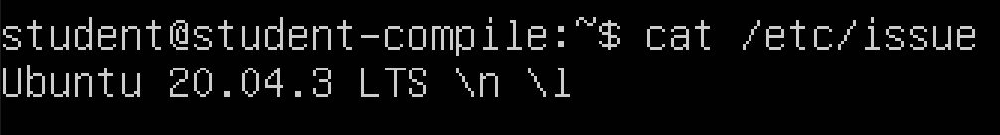

## Part 2. Создание пользователя

Создаем нового пользователя командой `useradd`.
>Используя флаг -G добалвяем пользователя в группу adm, а с помощью флага -p задаем пароль.

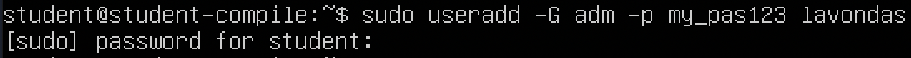

Вывод всех пользоватетей командой `cat /etc/passwd`.

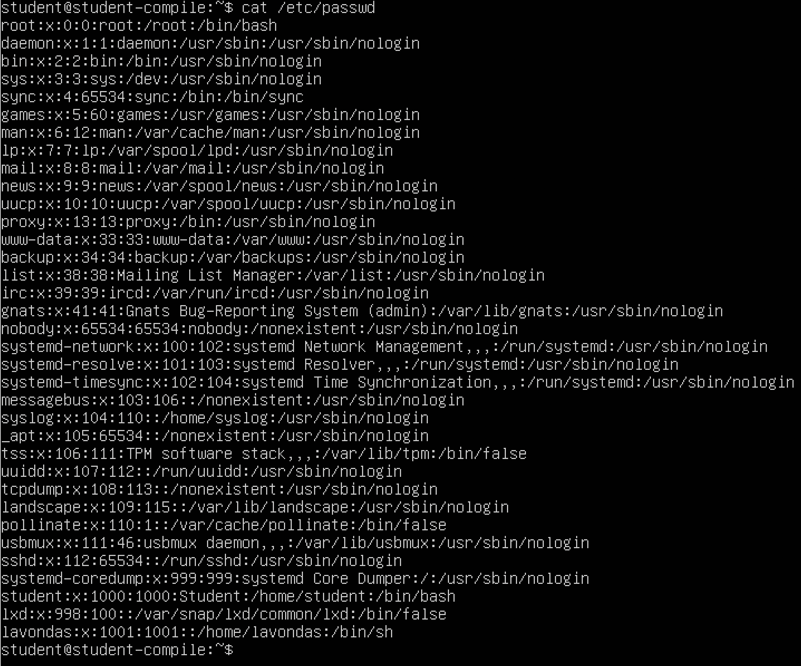

## Part 3. Настройка сети ОС

- Задаëм название машины user-1, используя команду `hostnamectl set-hostname user-1`.

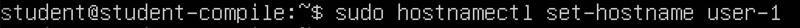

-  Устанавливаем локальную временную зону.
> Команда `timedatectl set-timezone` позволяет установить временную зону из списка всех существующих временных зон. Посмотреть все временные зоны можно командой `timedatectl list`.

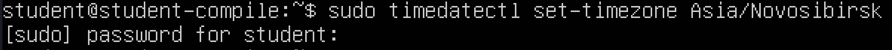

- Вывод названий сетевых интерфейсов с помощью команды `ip addr`.

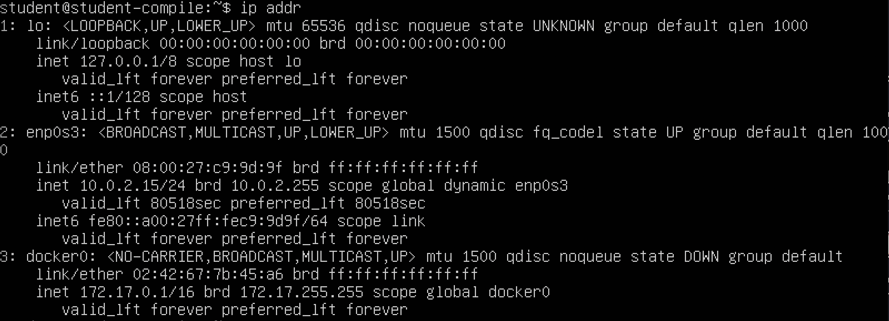

>Localhost (lo) - pарезервированное доменное имя для частных IP-адресов (в диапазоне 127.0.0.1 — 127.255.255.254). Для сети, состоящей только из одного компьютера, как правило, используется всего один адрес — 127.0.0.1, который устанавливается на специальный сетевой интерфейс «внутренней петли» (англ. loopback) в сетевом протоколе TCP/IP. Использование адреса 127.0.0.1 позволяет устанавливать соединение и передавать информацию для программ-серверов, работающих на том же компьютере, что и программа-клиент.

- Используя консольную команду `dhclient -v enp0s3` получаем ip-адрес устройства от DHCP сервера.

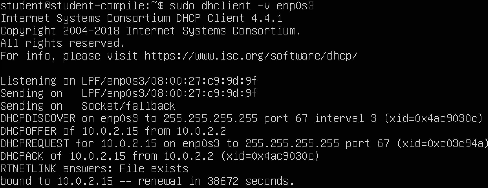
>DHCP (Dynamic Host Configuration Protocol) - протокол прикладного уровня модели TCP/IP, служит для назначения IP-адреса клиенту.

- Вывод внутреннего ip-адреса шлюза командой `ip route`.

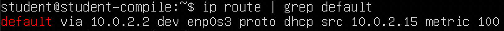

- Вывод внешнего ip-адреса шлюза командой `curl 'ifconfig.me'`.

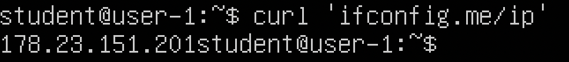

- Задаем статичные настройки ip, gw, dns редактируя файл `/etc.netplan/00-installer-config.yaml`. 

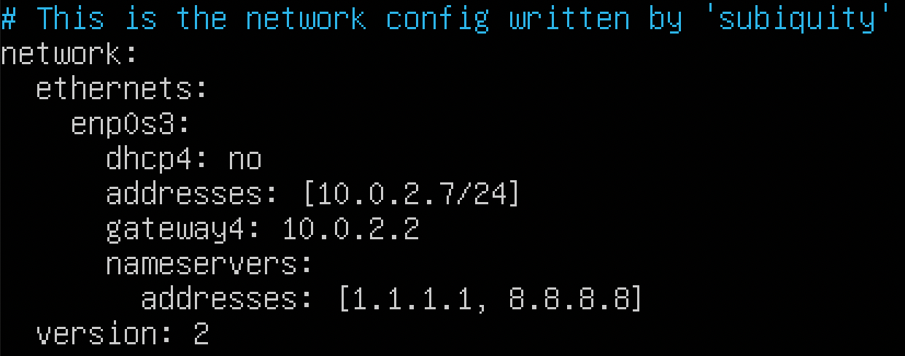

- Пропингуем хост 1.1.1.1.

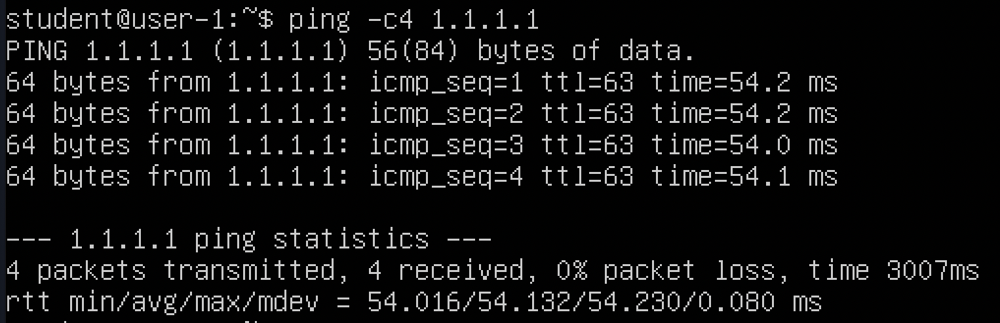

- Пропингуем хост ya.ru.

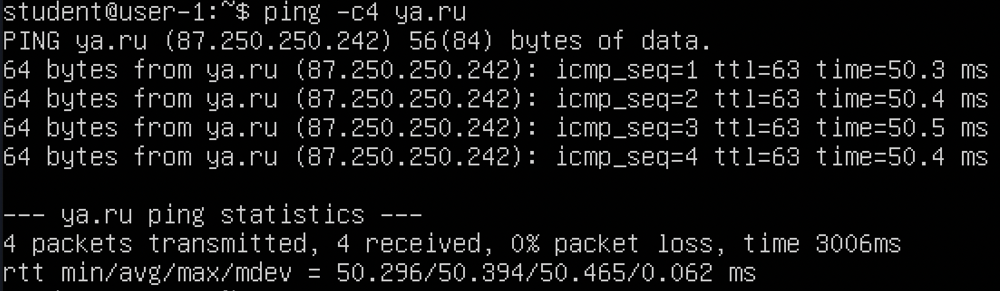

## Part 4. Обновление ОС

Обновляем системные пакеты командой `sudo apt-get upgrade`

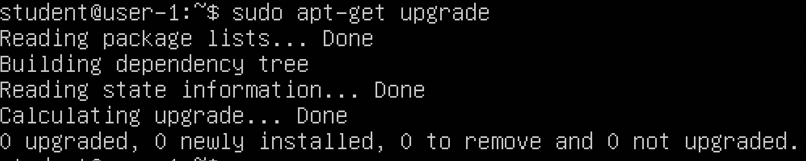

## Part 5. Использование команды **sudo**

Используя команду `sudo usermod st-aG sudo lavondas` даем право использовать *sudo*.

Заходим по именем созданного ранее пользователя с помощью команды `su lavondas` и меняем hostname с помощью комманды `sudo hostnamectl set-hostname lol`.

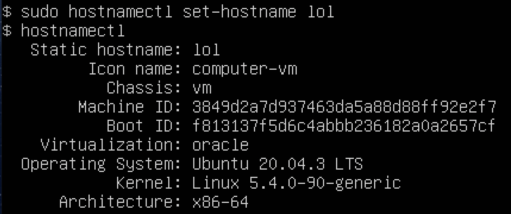

## Part 6 Установка и настройка службы времени

Время успешно настроено.

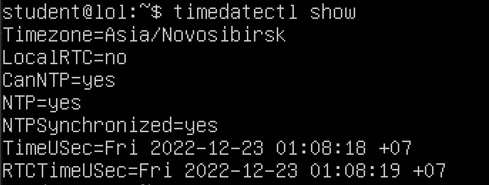

## Part 7. Установка и использование текстовых редакторов 

В этом задании я решила использовать редакторы Vim, nano, mcedit. Чтобы скачать редакторы используем команду `sudo apt install name_redactor`.

### Vim

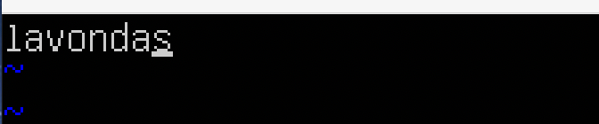

>Чтобы создать файл и открыть вводим команду `vim test_vim.txt`. Чтобы начать ввод текста, нажимаем на клавишу I. Входим в командный режим клавишой esc, вводим сочетание :wq чтобы сохранить и выйти из редактора.

### Nano

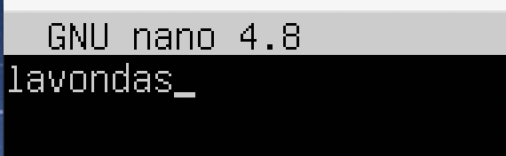

>Чтобы создать файл и открыть вводим команду `vim test_nano.txt`. Чтобы сохранить файл используем сочетание ctrl+o, а чтобы выйти ctrl+x и нажимаем Enter.

### Mcedit

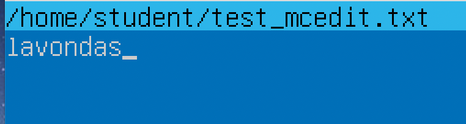

>Чтобы создать файл и открыть вводим команду `vim test_mcedit.txt`. Для сохранения файла можно воспользоваться клавишей F2. Для выхода из редактора используем клавишу F10.

### Vim
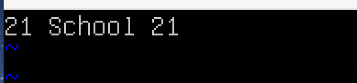

>Для того чтобы выйти без сохранений в командной строке пишем ':q!'.

### Nano

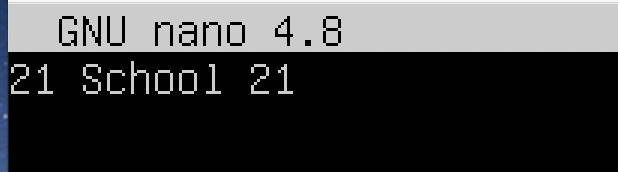

>Для того чтобы выйти без сохранений просто выходим при помощи ctrl+X и отказываемся сохранить изменения.

### Mcedit

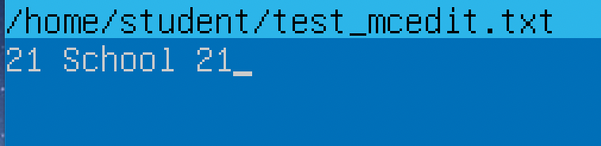

>Можно выйти при помощи F10. При выходе отказаться от изменений.

### Vim
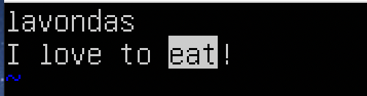

>Для поиска и замены пишем :s/искомое_слово/заменяющее_слово. Искомое слово подсвечивается.

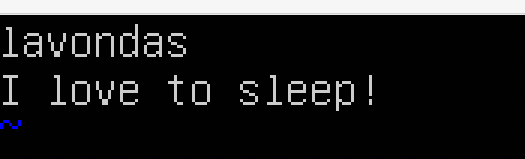

### Nano

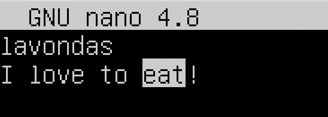

>Для поиска и замены используем хоткей ctrl+\ ищем нужное слово/строку, затем выбираем на что сменить.

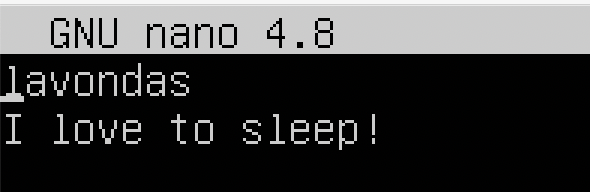

### Mcedit

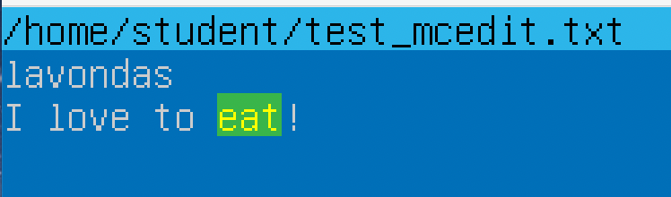
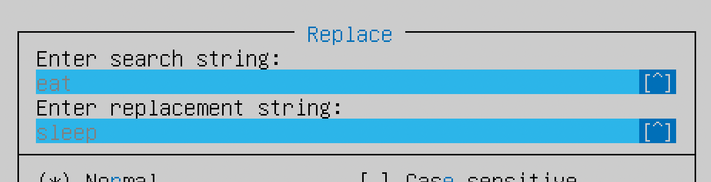

>При помощи F4 можно найти слово и ввести ему замену.

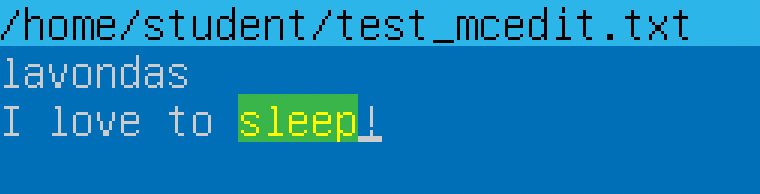
 
 ## Part 8. Установка и базовая настройка сервиса **SSHD**

Используем `sudo apt install openssh-server` и устанавливаем службу ssh.  

Используем `sudo systemctl enable ssh` для того чтобы установить службу на автоматическую загрузку при включении.  

Чтобы перенастроить службу SSHd на порт 2022 для этого нам нужно отредактировать файл `/etc/ssh/sshd_config`  
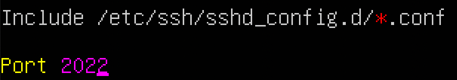

Используем команду `ps -FC sshd`. Флаг -С позволяет фильтровать процессы по имени, -F выводит более подробное описание.
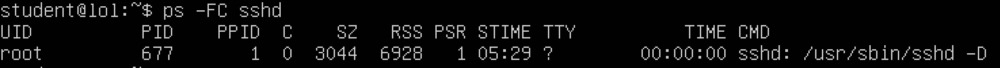

Используем команду netstat -tan
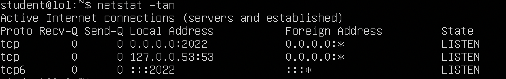  

Флаг *-a* выводит список всех портов (как TCP, так и UDP).  

Флаг *-t* выводит порты с протоколом TCP.  

Флаг *-n* показывает ip адрес, а не сетевое имя.

*Proto* - протокол (tcp, udp, raw), используемый сокетом.

*Recv-Q* - счётчик байт не скопированных программой пользователя из этого сокета.  

*Send-Q* - счётчик байтов, не подтверждённых удалённым узлом.  

*Local Address* - адрес и номер порта локального конца сокета.

*Foreign Address* - адрес и номер порта удалённого конца сокета.

*State* - состояние сокета.

*LISTEN* - сокет ожидает входящих подключений

*0.0.0.0* - это специальный адрес IPv4, который выполняет разные функции. В программе netstat используется запись 0.0.0.0:* которая обозначает «любой IPv4 адрес с любого порта».

## Part 9. Установка и использование утилит **top**, **htop**

### top

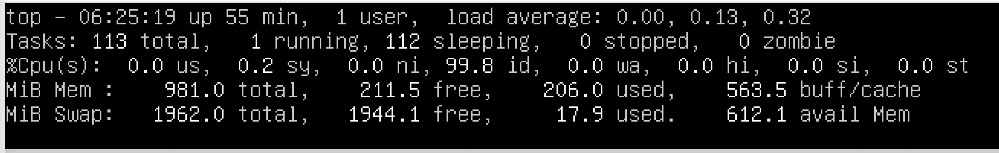

- uptime: 55 мин
- количество авторизованных пользователей: 1
- общую загрузку системы: 0.00, 0.13, 0.32
- общее количество процессов: 113
- загрузку cpu: 0.0 us, 0.2 sy, 0.0 ni, 99.8 id, 0.0 wa, 0.0 hi, 0.0 hi, 0.0 si, 0.0 st
- загрузку памяти: 206.0
- pid процесса занимающего больше всего памяти: 4657
- pid процесса, занимающего больше всего процессорного времени: 96814

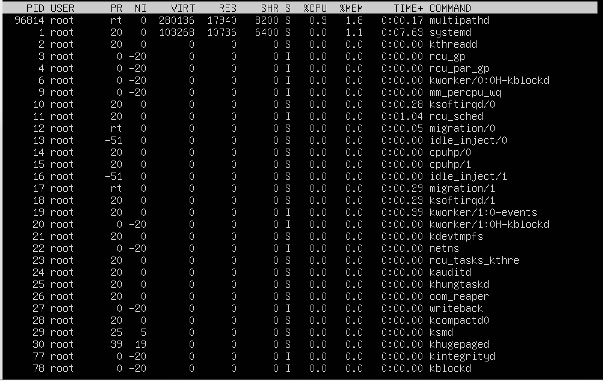

### htop
- Отсортированному по PID

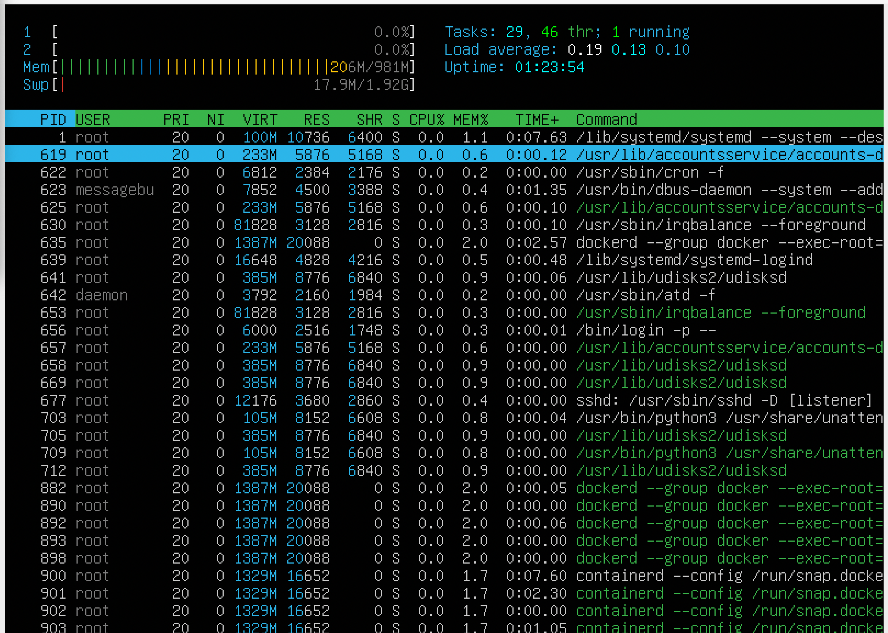

- Отсортированному по PERCENT_CPU

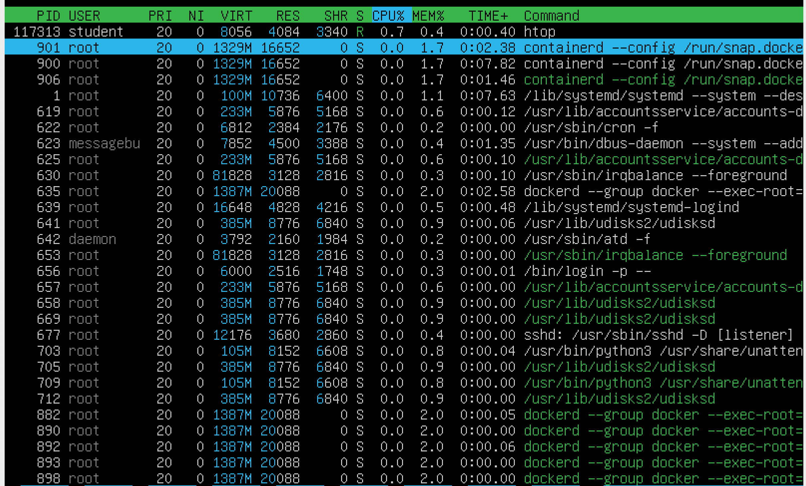

- Отсортированному по PERCENT_MEM

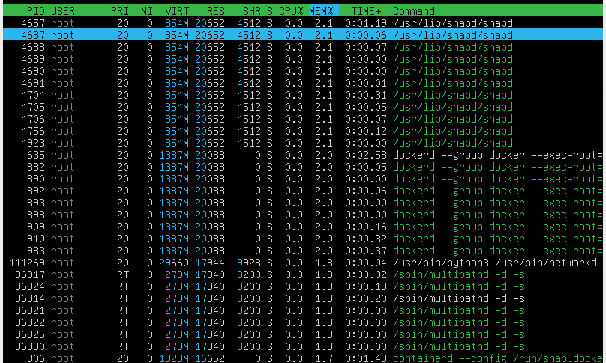

- Отсортированному по TIME

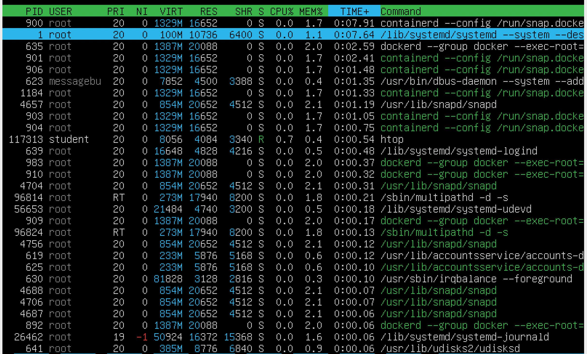

- Отфильтрованому по sshd

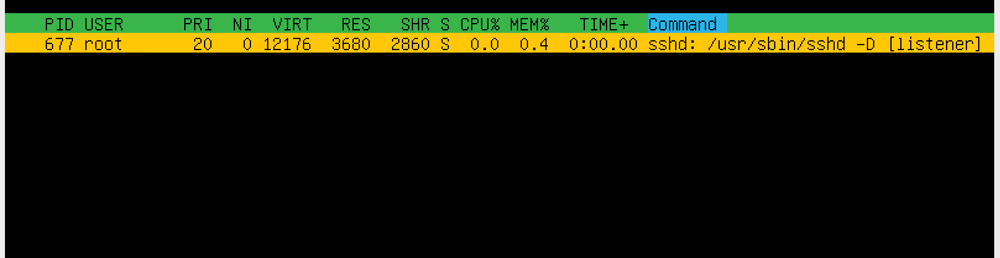

- С процессом syslog, найденным, используя поиск и с добавленным выводом hostname, clock и uptime

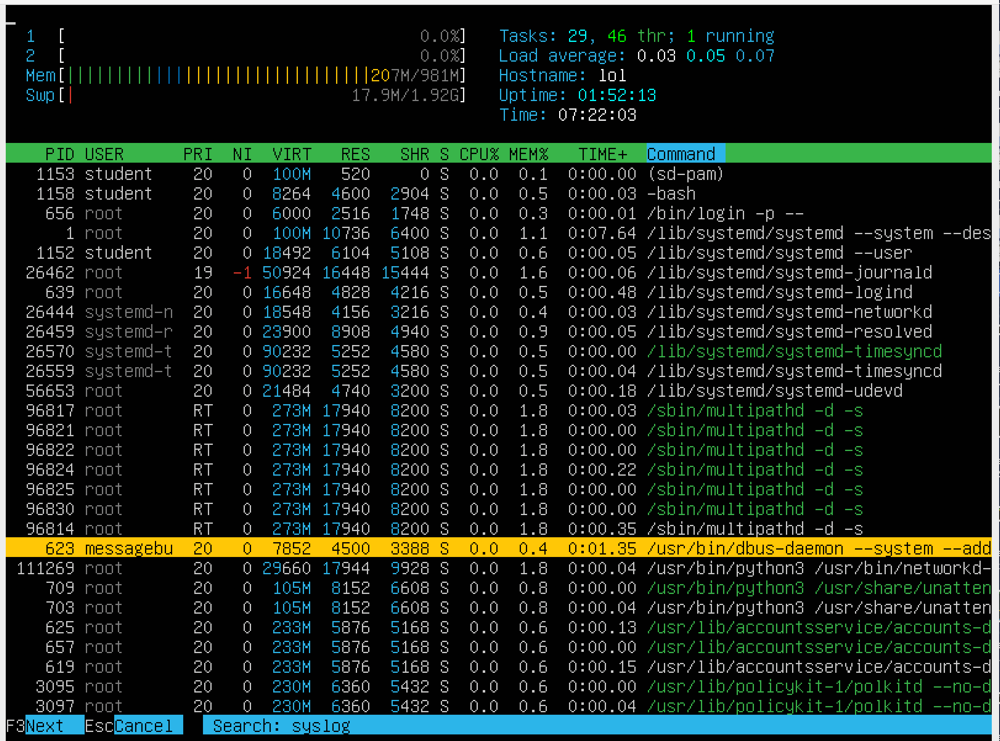

## Part 10. Использование утилиты **fdisk**

- Название жесткого диска: Disk /dev/sda
- Размер жесткого диска: 16 Gb
- Количество секторов: 33554432
- Размер swap: 2009084 (его можно уточнить отдельно вызвав команду swapon -s)

## Part 11. Использование утилиты **df** 

Запускаем команду df для корневого раздела /

- Размер раздела - 16445308K
- Размер занятого пространства - 6213028K
- Размер свободного пространства - 9377192K
- Процент использования - 40% 

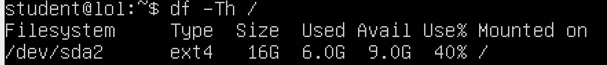

Запускаем команду df -Th для корневого раздела /

- Размер раздела - 16G
- Размер занятого пространства - 6.0G
- Размер свободного пространства - 9.0G
- Процент использования - 40%
- Тип файловой системы для раздела - ext4

## Part 12. Использование утилиты **du**

Запускаем команду du

- Размер папок /home

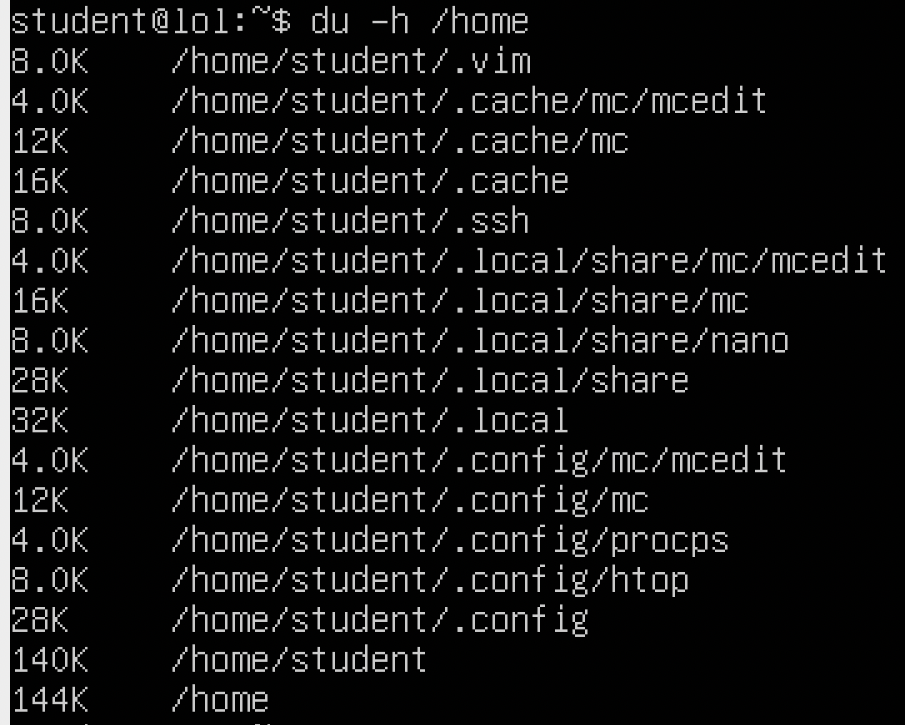

- Размер папок в /var, 

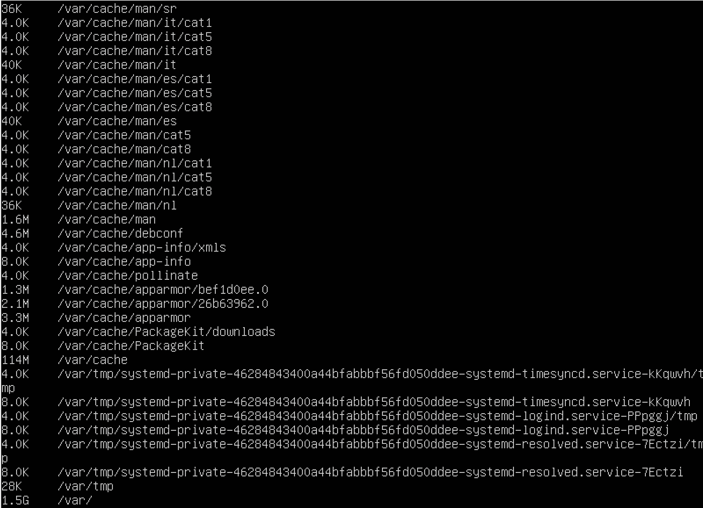

- Размер папок в /var/log 

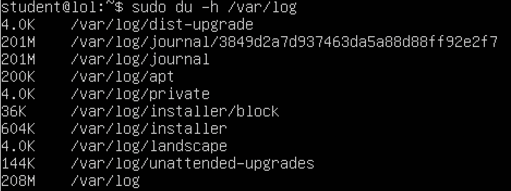

- Размер всего содержимого в /var/log/*

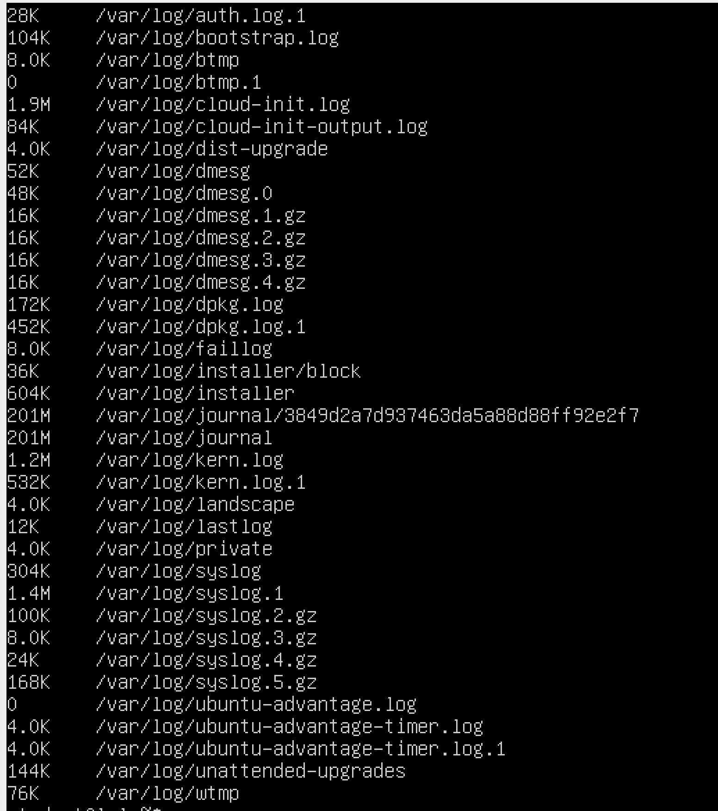

## Part 13. Установка и использование утилиты **ncdu**

Устанавливаем утилиту ncdu с помощью `sudo apt install ncdu`
- Размер папки /home

- Размер папки /var

- Размер папки /var/log 

## Part 14. Работа с системными журналами

Время последней успешной авторизации

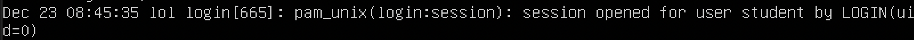

В /var/log/auth.log можно увидеть перезагрузку sshd после команды `sudo systemctl restart sshd.service`

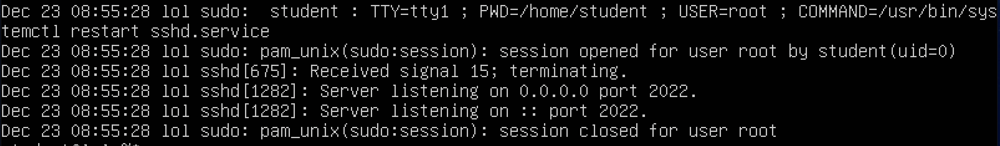

## Part 15. Использование планировщика заданий **CRON**

При помощи команды `crontab -e` вносим в запускаем команду uptime через каждые 2 минуты. Выводим на экран список текущих заданий при помощи команды `crontab -l`.

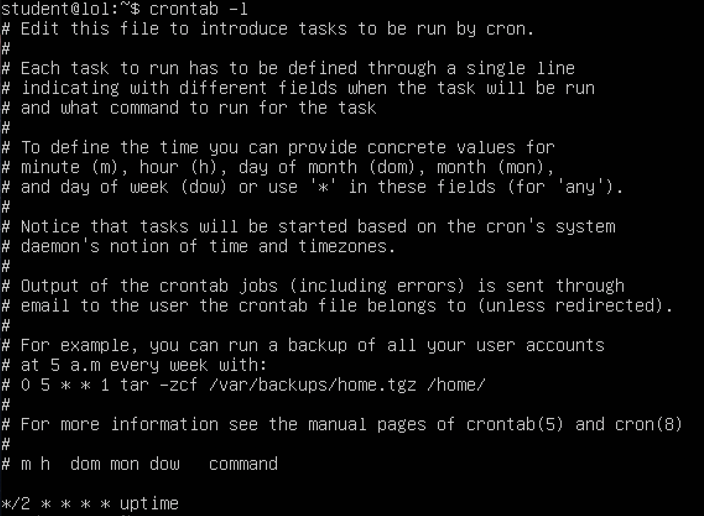

Видим список задач и то что они исполняются каждые 2 минуты.

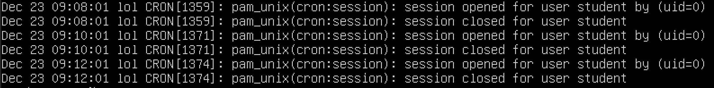

Удаляем все задания из планировщика заданий командой `crontab -r`, проверяем.

